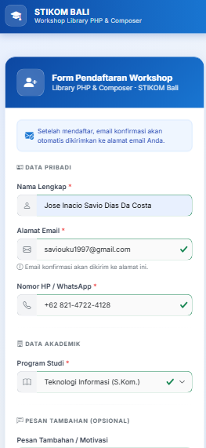
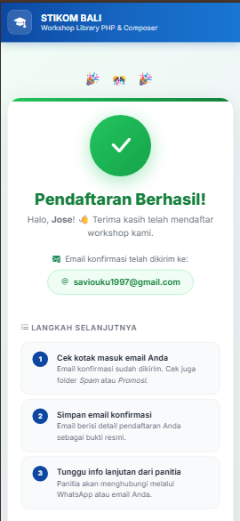
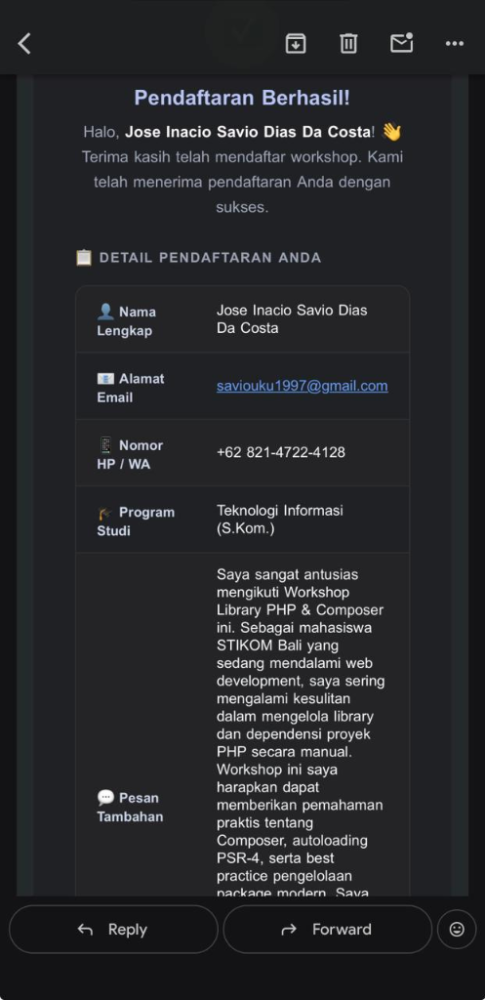

# 📦 Pendaftaran Konfirmasi PHPMailer

> **Proyek Latihan:** Materi "Library PHP" — Gede Herdian Setiawan, S.Kom., M.T.  
> **Institusi:** STIKOM Bali  
> **Tahun:** 2026

---

## 📋 Deskripsi Proyek

Proyek ini adalah aplikasi web sederhana berbasis PHP yang memungkinkan calon peserta untuk mendaftar **Workshop Library PHP & Composer** secara online. Setelah form pendaftaran disubmit, sistem akan secara otomatis mengirimkan **email konfirmasi pendaftaran** ke alamat email pendaftar menggunakan library **PHPMailer** yang diinstall via **Composer** dan dikirim melalui **SMTP Gmail**.

### ✨ Fitur Utama

| Fitur | Keterangan |
|-------|------------|
| 📝 Form Pendaftaran | Form responsif dengan Bootstrap 5.3.3 |
| ✅ Validasi Server-Side | Validasi PHP + `FILTER_VALIDATE_EMAIL` |
| 📧 Kirim Email Otomatis | PHPMailer + SMTP Gmail (port 587, STARTTLS) |
| 🎨 UI Modern | Desain profesional, mobile-friendly |
| 🔒 Keamanan | Sanitasi input, tidak hardcode credential |
| 🇮🇩 Bahasa Indonesia | Semua teks dalam Bahasa Indonesia |

### 🗂️ Struktur Folder

```
pendaftaran-konfirmasi-phpmailer/
├── index.php                  ← Halaman form pendaftaran
├── proses-pendaftaran.php     ← Backend: validasi & kirim email
├── sukses.php                 ← Halaman konfirmasi sukses
├── composer.json              ← Konfigurasi dependency Composer
├── README.md                  ← Dokumentasi ini
├── .gitignore                 ← File yang dikecualikan dari Git
└── vendor/                    ← Library (dihasilkan composer install)
```

---

## ⚙️ Prasyarat

Pastikan komputer Anda sudah terinstall:

- **PHP** versi 8.0 atau lebih baru
  ```
  php -v
  ```
- **Composer** (dependency manager PHP)
  ```
  composer --version
  ```
- **Akun Gmail** yang akan digunakan sebagai pengirim email
- Koneksi internet aktif

> 💡 Download Composer di: https://getcomposer.org/download/

---

## 🚀 Langkah-Langkah Setup

### Langkah 1 — Clone atau Download Proyek

**Opsi A: Clone dari GitHub (jika sudah push)**
```bash
git clone https://github.com/USERNAME/pendaftaran-konfirmasi-phpmailer.git
cd pendaftaran-konfirmasi-phpmailer
```

**Opsi B: Download manual**  
Download ZIP, ekstrak, lalu buka terminal di folder tersebut.

---

### Langkah 2 — Install Library via Composer

Jalankan perintah berikut di dalam folder proyek:

```bash
composer install
```

Perintah ini akan:
- Membaca file `composer.json`
- Mengunduh library **PHPMailer v6.9+** dari Packagist
- Membuat folder `vendor/` berisi semua library
- Membuat file `vendor/autoload.php` untuk autoloading

**Output yang diharapkan:**
```
Installing dependencies from lock file (or from source)
Package operations: 1 install, 0 updates, 0 removals
  - Installing phpmailer/phpmailer (v6.9.x): Extracting archive
Generating autoload files
```

---

### Langkah 3 — Dapatkan App Password Gmail

> ⚠️ **PENTING:** Jangan gunakan password Gmail biasa! Gmail mengharuskan penggunaan **App Password** untuk aplikasi pihak ketiga.

**Langkah mendapatkan App Password Gmail:**

1. Buka browser dan login ke akun Gmail Anda
2. Kunjungi: **https://myaccount.google.com/apppasswords**
3. Jika belum, aktifkan dulu **2-Step Verification**:
   - Kunjungi: https://myaccount.google.com/security
   - Cari "2-Step Verification" → Klik **Aktifkan**
   - Ikuti proses verifikasi (nomor HP)
4. Setelah 2-Step Verification aktif, kembali ke https://myaccount.google.com/apppasswords
5. Di kolom **"App name"**, ketik nama bebas, misalnya: `STIKOM Workshop PHP`
6. Klik tombol **Create** (Buat)
7. Google akan menampilkan **App Password berupa 16 karakter** (format: `xxxx xxxx xxxx xxxx`)
8. **Salin App Password tersebut** — password ini hanya ditampilkan sekali!

---

### Langkah 4 — Konfigurasi Kredensial di Kode

Buka file `proses-pendaftaran.php`, cari bagian berikut dan ganti dengan data Anda:

```php
// === GANTI DENGAN EMAIL GMAIL ANDA ===
$mail->Username = 'email-anda@gmail.com';

// === GANTI DENGAN APP PASSWORD GMAIL ANDA ===
$mail->Password = 'xxxx xxxx xxxx xxxx';
```

```php
// === GANTI 'email-anda@gmail.com' DENGAN EMAIL GMAIL ANDA ===
$mail->setFrom('email-anda@gmail.com', 'STIKOM Bali - Workshop PHP');
```

**Contoh setelah diisi:**
```php
$mail->Username = 'mahasiswa.stikom@gmail.com';
$mail->Password = 'abcd efgh ijkl mnop';  // App Password dari Google
$mail->setFrom('mahasiswa.stikom@gmail.com', 'STIKOM Bali - Workshop PHP');
```

> 🔐 **Catatan Keamanan:** Jangan pernah commit file dengan password asli ke GitHub!  
> Untuk proyek nyata, gunakan file `.env` yang sudah dikecualikan di `.gitignore`.

---

### Langkah 5 — Jalankan di Lokal

Gunakan PHP built-in web server untuk menjalankan proyek:

```bash
php -S localhost:8080
```

Kemudian buka browser dan akses:

```
http://localhost:8080
```

Anda akan melihat halaman form pendaftaran workshop. ✅

---

## 📤 Push ke GitHub

### Langkah 1 — Inisialisasi Git

```bash
git init
```

### Langkah 2 — Tambahkan File ke Staging

```bash
git add .
```

> **Catatan:** Folder `vendor/` otomatis diabaikan karena sudah ada di `.gitignore`

### Langkah 3 — Commit Pertama

```bash
git commit -m "feat: inisialisasi proyek pendaftaran workshop PHPMailer"
```

### Langkah 4 — Buat Repository di GitHub

1. Buka https://github.com → Login
2. Klik tombol **New** (Repository baru)
3. Isi nama repository: `pendaftaran-konfirmasi-phpmailer`
4. Pilih **Public**
5. **JANGAN** centang "Add a README file" (sudah ada)
6. Klik **Create repository**

### Langkah 5 — Hubungkan & Push

Salin perintah dari GitHub (bagian "...or push an existing repository"), contoh:

```bash
git remote add origin https://github.com/USERNAME/pendaftaran-konfirmasi-phpmailer.git
git branch -M main
git push -u origin main
```

Ganti `USERNAME` dengan username GitHub Anda.

---

## 📸 Daftar Screenshot Wajib untuk Pengumpulan Tugas

Ambil screenshot berikut sebagai bukti pengerjaan tugas:

| No | Screenshot | Cara Mengambil |
|----|-----------|----------------|
| **1** | 📝 **Form pendaftaran yang sudah terisi lengkap** | Buka `http://localhost:8080`, isi semua field form, lalu screenshot sebelum klik submit |
| **2** | ✅ **Halaman sukses setelah pendaftaran** | Setelah submit form berhasil, screenshot halaman `sukses.php` yang muncul |
| **3** | 📧 **Inbox Gmail + isi email konfirmasi** | Buka Gmail, klik email konfirmasi yang masuk, screenshot isi email yang terbuka |
| **4** | 🐙 **Halaman GitHub repository** | Screenshot halaman repository di GitHub setelah push berhasil |

### 🖼️ Galeri Screenshot Hasil Pengerjaan

> 💡 **Petunjuk:** Buatlah sebuah folder baru bernama `screenshots/` di dalam folder proyek ini, lalu simpan file gambar screenshot Anda di dalamnya dengan nama file seperti di bawah ini agar otomatis tampil secara rapi pada halaman GitHub Anda:

#### 1. Form Pendaftaran Terisi Lengkap (`screenshots/01-form-daftar.png`)


#### 2. Halaman Sukses Pendaftaran (`screenshots/02-sukses-daftar.png`)


#### 3. Bukti Email Konfirmasi di Inbox Gmail (`screenshots/03-email-konfirmasi.png`)


---

## 🛠️ Teknologi yang Digunakan

| Teknologi | Versi | Keterangan |
|-----------|-------|------------|
| PHP | 8.0+ | Bahasa pemrograman server-side |
| PHPMailer | ^6.9 | Library pengiriman email via SMTP |
| Composer | Latest | Dependency manager PHP |
| Bootstrap | 5.3.3 | Framework CSS via CDN |
| Bootstrap Icons | 1.11.3 | Ikon via CDN |
| Google Fonts (Inter) | — | Tipografi modern via CDN |
| Gmail SMTP | — | Server pengirim email |

---

## 🔧 Troubleshooting

### ❌ Error: `Could not authenticate`
- Pastikan App Password yang dimasukkan benar (16 karakter)
- Pastikan 2-Step Verification sudah diaktifkan
- Pastikan email pengirim sama dengan yang di `Username`

### ❌ Error: `Failed to connect to smtp.gmail.com`
- Pastikan koneksi internet aktif
- Pastikan port 587 tidak diblokir firewall/antivirus
- Coba matikan sementara antivirus dan coba lagi

### ❌ Error: `Class 'PHPMailer\PHPMailer\PHPMailer' not found`
- Pastikan `composer install` sudah dijalankan
- Pastikan folder `vendor/` ada di direktori proyek
- Pastikan baris `require 'vendor/autoload.php';` ada di `proses-pendaftaran.php`

### ❌ Email masuk ke folder Spam
- Ini normal untuk email dari server development
- Buka email spam tersebut, klik "Bukan Spam"
- Untuk produksi, pertimbangkan menggunakan layanan seperti SendGrid atau Mailgun

---

## 📚 Referensi

- [PHPMailer GitHub](https://github.com/PHPMailer/PHPMailer)
- [PHPMailer Packagist](https://packagist.org/packages/phpmailer/phpmailer)
- [Dokumentasi Composer](https://getcomposer.org/doc/)
- [Gmail App Password](https://myaccount.google.com/apppasswords)
- [Bootstrap 5.3](https://getbootstrap.com/docs/5.3/)

---

## 👨‍💻 Informasi Proyek

- **Matakuliah:** Pemrograman Web / Library PHP
- **Dosen:** Gede Herdian Setiawan, S.Kom., M.T.
- **Institusi:** STIKOM Bali
- **Tahun Akademik:** 2026

---
